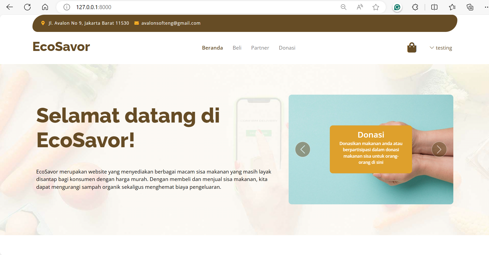

# EcoSavor
EcoSavor is a website that provides a variety of leftover food that is still fit to eat for consumers at low prices. By buying and selling leftover food we can reduce organic waste and save costs.

## Requirements
- PHP 8 or higher
- Composer
- Node.js and NPM

## Installation

1. **Clone the Repository**
   ```
   git clone https://github.com/avalonsofteng/AOL-softeng.git
   cd your-repo
   ```
   switch to testing
   ```
   git switch testing
   ```

2. **Install Dependencies**
    ```
    composer install
    composer require laravel/breeze --dev
    npm install
    npm run dev
    ```

3. **Database Configuration**
    - Copy file `.env.example` menjadi `.env`
        ```
        cp .env.example .env
        ```
    - Generate application key
        ```
        php artisan key:generate    
        ```  
    - edit file .env :
        ```
        DB_CONNECTION=mysql
        DB_HOST=127.0.0.1
        DB_PORT=3306
        DB_DATABASE=Avalon
        DB_USERNAME=root
        DB_PASSWORD=
        ```

4. **Migrasi Database**
    ```
    php artisan migrate
    ```

5. **Run the Server**
    ```
    php artisan ser
    ```

# Overview
- **Tampilan Home**
    


- **Tampilan Buy**


- **Tampilan Partner**


- **Tampilan Donasi**


- **Tampilan Keranjang**


- **Tampilan Login**


- **Tampilan Admin**


